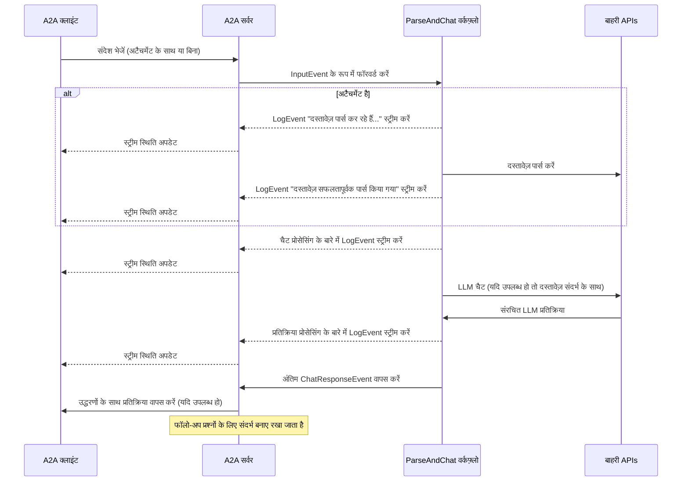

यह उदाहरण [LlamaIndex Workflows](https://docs.llamaindex.ai/en/stable/understanding/workflows/) के साथ बनाए गए और A2A प्रोटोकॉल के माध्यम से उजागर किए गए एक संवादी एजेंट को प्रदर्शित करता है। यह फ़ाइल अपलोड और पार्सिंग, मल्टी-टर्न संवाद के समर्थन के साथ संवादी इंटरैक्शन, स्ट्रीमिंग प्रतिक्रियाएं/अपडेट, और इन-लाइन उद्धरण प्रदर्शित करता है।

## स्रोत कोड
[a2a llama index file chat with openrouter](https://github.com/sing1ee/a2a_llama_index_file_chat)

## यह कैसे काम करता है

यह एजेंट OpenRouter के साथ LlamaIndex Workflows का उपयोग करके एक संवादी एजेंट प्रदान करता है जो फ़ाइलें अपलोड कर सकता है, उन्हें पार्स कर सकता है, और सामग्री के बारे में प्रश्नों के उत्तर दे सकता है। A2A प्रोटोकॉल एजेंट के साथ मानकीकृत इंटरैक्शन को सक्षम बनाता है, जिससे क्लाइंट अनुरोध भेज सकते हैं और रियल-टाइम अपडेट प्राप्त कर सकते हैं।



## मुख्य विशेषताएं

- **फ़ाइल अपलोड**: क्लाइंट फ़ाइलें अपलोड कर सकते हैं और चैट को संदर्भ प्रदान करने के लिए उन्हें पार्स कर सकते हैं
- **मल्टी-टर्न बातचीत**: एजेंट आवश्यकता पड़ने पर अतिरिक्त जानकारी का अनुरोध कर सकता है
- **रियल-टाइम स्ट्रीमिंग**: प्रोसेसिंग के दौरान स्थिति अपडेट प्रदान करता है
- **पुश नोटिफिकेशन**: webhook-आधारित नोटिफिकेशन के लिए समर्थन
- **संवादी मेमोरी**: एक ही सत्र में इंटरैक्शन के बीच संदर्भ बनाए रखता है
- **LlamaParse एकीकरण**: फ़ाइलों को सटीक रूप से पार्स करने के लिए LlamaParse का उपयोग करता है

**नोट:** यह नमूना एजेंट मल्टीमॉडल इनपुट स्वीकार करता है, लेकिन लेखन के समय, नमूना UI केवल टेक्स्ट इनपुट का समर्थन करता है। UI भविष्य में इस और अन्य उपयोग मामलों को संभालने के लिए मल्टीमॉडल बन जाएगा।

## आवश्यकताएं

- Python 3.12 या उच्चतर
- [UV](https://docs.astral.sh/uv/)
- LLM और API Key तक पहुंच (वर्तमान कोड OpenRouter API का उपयोग मानता है)
- एक LlamaParse API key ([मुफ्त में प्राप्त करें](https://cloud.llamaindex.ai))

## सेटअप और चलाना

1. प्रोजेक्ट डायरेक्टरी को क्लोन करें और नेविगेट करें:

   ```bash
   git clone https://github.com/sing1ee/a2a_llama_index_file_chat
   cd a2a_llama_index_file_chat
   ```

2. एक वर्चुअल एनवायरनमेंट बनाएं और डिपेंडेंसी इंस्टॉल करें:

   ```bash
   uv venv
   uv sync
   ```

3. अपनी API keys के साथ एक एनवायरनमेंट फ़ाइल बनाएं:

   ```bash
   echo "OPENROUTER_API_KEY=your_api_key_here" >> .env
   echo "LLAMA_CLOUD_API_KEY=your_api_key_here" >> .env
   ```

   **API Keys प्राप्त करना:**
   - **OpenRouter API Key**: अपनी मुफ्त API key प्राप्त करने के लिए [https://openrouter.ai](https://openrouter.ai) पर साइन अप करें
   - **LlamaCloud API Key**: [https://cloud.llamaindex.ai](https://cloud.llamaindex.ai) पर मुफ्त में प्राप्त करें

4. एजेंट चलाएं:

   ```bash
   # uv का उपयोग करके
   uv run a2a-file-chat

   # या वर्चुअल एनवायरनमेंट को सक्रिय करें और सीधे चलाएं
   source .venv/bin/activate  # Windows पर: .venv\Scripts\activate
   python -m a2a_file_chat

   # कस्टम host/port के साथ
   uv run a2a-file-chat --host 0.0.0.0 --port 8080
   ```

4. एक अलग टर्मिनल में, A2A क्लाइंट cli चलाएं:

  पार्स करने के लिए एक फ़ाइल डाउनलोड करें, या अपनी खुद की फ़ाइल से लिंक करें। उदाहरण के लिए:

   ```bash
   curl -L https://arxiv.org/pdf/1706.03762 -o attention.pdf
   ```

   ```bash
   git clone https://github.com/google-a2a/a2a-samples.git
   cd a2a-samples/samples/python/hosts/cli
   uv run . --agent http://localhost:10010
   ```

   और निम्नलिखित जैसा कुछ दर्ज करें:

   ```bash
   ======= Agent Card ========
   {"name":"Parse and Chat","description":"Parses a file and then chats with a user using the parsed content as context.","url":"http://localhost:10010/","version":"1.0.0","capabilities":{"streaming":true,"pushNotifications":true,"stateTransitionHistory":false},"defaultInputModes":["text","text/plain"],"defaultOutputModes":["text","text/plain"],"skills":[{"id":"parse_and_chat","name":"Parse and Chat","description":"Parses a file and then chats with a user using the parsed content as context.","tags":["parse","chat","file","llama_parse"],"examples":["What does this file talk about?"]}]}
   =========  starting a new task ======== 

   What do you want to send to the agent? (:q or quit to exit): यह फ़ाइल किस बारे में बात करती है?
   Select a file path to attach? (press enter to skip): ./attention.pdf
   ```

## तकनीकी कार्यान्वयन

- **LlamaIndex Workflows**: फ़ाइल को पार्स करने और फिर उपयोगकर्ता के साथ चैट करने के लिए एक कस्टम वर्कफ़्लो का उपयोग करता है
- **स्ट्रीमिंग समर्थन**: प्रोसेसिंग के दौरान वृद्धिशील अपडेट प्रदान करता है
- **सीरियलाइज़ेबल संदर्भ**: टर्न के बीच बातचीत की स्थिति बनाए रखता है, वैकल्पिक रूप से redis, mongodb, डिस्क आदि में बनाए रखा जा सकता है
- **पुश नोटिफिकेशन सिस्टम**: JWK प्रमाणीकरण के साथ Webhook-आधारित अपडेट
- **A2A प्रोटोकॉल एकीकरण**: A2A विनिर्देशों के साथ पूर्ण अनुपालन

## सीमाएं

- केवल टेक्स्ट-आधारित आउटपुट का समर्थन करता है
- LlamaParse पहले 10K क्रेडिट के लिए मुफ्त है (बुनियादी सेटिंग्स के साथ ~3333 पृष्ठ)
- मेमोरी सत्र-आधारित और इन-मेमोरी है, और इसलिए सर्वर रीस्टार्ट के बीच बनी नहीं रहती
- पूरे दस्तावेज़ को संदर्भ विंडो में डालना बड़ी फ़ाइलों के लिए स्केलेबल नहीं है। आप प्रभावी RAG के लिए एक या अधिक फ़ाइलों पर रिट्रीवल चलाने के लिए एक वेक्टर DB तैनात करना या क्लाउड DB का उपयोग करना चाह सकते हैं। LlamaIndex [बहुत सारे वेक्टर DBs और क्लाउड DBs](https://docs.llamaindex.ai/en/stable/examples/#vector-stores) के साथ एकीकृत होता है।

## उदाहरण

**सिंक्रोनस अनुरोध**

अनुरोध:

```
POST http://localhost:10010
Content-Type: application/json

{
  "jsonrpc": "2.0",
  "id": 11,
  "method": "tasks/send",
  "params": {
    "id": "129",
    "sessionId": "8f01f3d172cd4396a0e535ae8aec6687",
    "acceptedOutputModes": [
      "text"
    ],
    "message": {
      "role": "user",
      "parts": [
        {
          "type": "text",
          "text": "यह फ़ाइल किस बारे में बात करती है?"
        },
        {
            "type": "file",
            "file": {
                "bytes": "...",
                "name": "attention.pdf"
            }
        }
      ]
    }
  }
}
```

प्रतिक्रिया:

```
{
  "jsonrpc": "2.0",
  "id": 11,
  "result": {
    "id": "129",
    "status": {
      "state": "completed",
      "timestamp": "2025-04-02T16:53:29.301828"
    },
    "artifacts": [
      {
        "parts": [
          {
            "type": "text",
            "text": "यह फ़ाइल XYZ के बारे में है... [1]"
          }
        ],
        "metadata": {
            "1": ["उद्धरण 1 के लिए टेक्स्ट"]
        }
        "index": 0,
      }
    ],
  }
}
```

**मल्टी-टर्न उदाहरण**

अनुरोध - अनुक्रम 1:

```
POST http://localhost:10010
Content-Type: application/json

{
  "jsonrpc": "2.0",
  "id": 11,
  "method": "tasks/send",
  "params": {
    "id": "129",
    "sessionId": "8f01f3d172cd4396a0e535ae8aec6687",
    "acceptedOutputModes": [
      "text"
    ],
    "message": {
      "role": "user",
      "parts": [
        {
          "type": "text",
          "text": "यह फ़ाइल किस बारे में बात करती है?"
        },
        {
            "type": "file",
            "file": {
                "bytes": "...",
                "name": "attention.pdf"
            }
        }
      ]
    }
  }
}
```

प्रतिक्रिया - अनुक्रम 2:

```
{
  "jsonrpc": "2.0",
  "id": 11,
  "result": {
    "id": "129",
    "status": {
      "state": "completed",
      "timestamp": "2025-04-02T16:53:29.301828"
    },
    "artifacts": [
      {
        "parts": [
          {
            "type": "text",
            "text": "यह फ़ाइल XYZ के बारे में है... [1]"
          }
        ],
        "metadata": {
            "1": ["उद्धरण 1 के लिए टेक्स्ट"]
        }
        "index": 0,
      }
    ],
  }
}
```

अनुरोध - अनुक्रम 3:

```
POST http://localhost:10010
Content-Type: application/json

{
  "jsonrpc": "2.0",
  "id": 11,
  "method": "tasks/send",
  "params": {
    "id": "130",
    "sessionId": "8f01f3d172cd4396a0e535ae8aec6687",
    "acceptedOutputModes": [
      "text"
    ],
    "message": {
      "role": "user",
      "parts": [
        {
          "type": "text",
          "text": "X चीज़ के बारे में क्या?"
        }
      ]
    }
  }
}
```

प्रतिक्रिया - अनुक्रम 4:

```
{
  "jsonrpc": "2.0",
  "id": 11,
  "result": {
    "id": "130",
    "status": {
      "state": "completed",
      "timestamp": "2025-04-02T16:53:29.301828"
    },
    "artifacts": [
      {
        "parts": [
          {
            "type": "text",
            "text": "X चीज़ है... [1]"
          }
        ],
        "metadata": {
            "1": ["उद्धरण 1 के लिए टेक्स्ट"]
        }
        "index": 0,
      }
    ],
  }
}
```

**स्ट्रीमिंग उदाहरण**

अनुरोध:

```
{
  "jsonrpc": "2.0",
  "id": 11,
  "method": "tasks/send",
  "params": {
    "id": "129",
    "sessionId": "8f01f3d172cd4396a0e535ae8aec6687",
    "acceptedOutputModes": [
      "text"
    ],
    "message": {
      "role": "user",
      "parts": [
        {
          "type": "text",
          "text": "यह फ़ाइल किस बारे में बात करती है?"
        },
        {
            "type": "file",
            "file": {
                "bytes": "...",
                "name": "attention.pdf"
            }
        }
      ]
    }
  }
}
```

प्रतिक्रिया:

```
stream event => {"jsonrpc":"2.0","id":"367d0ba9af97457890261ac29a0f6f5b","result":{"id":"373b26d64c5a4f0099fa906c6b7342d9","status":{"state":"working","message":{"role":"agent","parts":[{"type":"text","text":"दस्तावेज़ पार्स कर रहे हैं..."}]},"timestamp":"2025-04-15T16:05:18.283682"},"final":false}}

stream event => {"jsonrpc":"2.0","id":"367d0ba9af97457890261ac29a0f6f5b","result":{"id":"373b26d64c5a4f0099fa906c6b7342d9","status":{"state":"working","message":{"role":"agent","parts":[{"type":"text","text":"दस्तावेज़ सफलतापूर्वक पार्स किया गया।"}]},"timestamp":"2025-04-15T16:05:24.200133"},"final":false}}

stream event => {"jsonrpc":"2.0","id":"367d0ba9af97457890261ac29a0f6f5b","result":{"id":"373b26d64c5a4f0099fa906c6b7342d9","status":{"state":"working","message":{"role":"agent","parts":[{"type":"text","text":"1 प्रारंभिक संदेशों के साथ चैट कर रहे हैं।"}]},"timestamp":"2025-04-15T16:05:24.204757"},"final":false}}

stream event => {"jsonrpc":"2.0","id":"367d0ba9af97457890261ac29a0f6f5b","result":{"id":"373b26d64c5a4f0099fa906c6b7342d9","status":{"state":"working","message":{"role":"agent","parts":[{"type":"text","text":"सिस्टम प्रॉम्प्ट डाल रहे हैं..."}]},"timestamp":"2025-04-15T16:05:24.204810"},"final":false}}

stream event => {"jsonrpc":"2.0","id":"367d0ba9af97457890261ac29a0f6f5b","result":{"id":"373b26d64c5a4f0099fa906c6b7342d9","status":{"state":"working","message":{"role":"agent","parts":[{"type":"text","text":"LLM प्रतिक्रिया प्राप्त हुई, उद्धरण पार्स कर रहे हैं..."}]},"timestamp":"2025-04-15T16:05:26.084829"},"final":false}}

stream event => {"jsonrpc":"2.0","id":"367d0ba9af97457890261ac29a0f6f5b","result":{"id":"373b26d64c5a4f0099fa906c6b7342d9","artifact":{"parts":[{"type":"text","text":"यह फ़ाइल Transformer पर चर्चा करती है, जो एक नया न्यूरल नेटवर्क आर्किटेक्चर है जो पूरी तरह से attention mechanisms पर आधारित है, recurrence और convolutions को पूरी तरह से छोड़ देता है [1]। दस्तावेज़ Transformer की तुलना recurrent और convolutional layers से करता है [2], मॉडल आर्किटेक्चर का विवरण देता है [3], और machine translation और English constituency parsing कार्यों के परिणाम प्रस्तुत करता है [4]।"}],"metadata":{"1":["प्रमुख sequence transduction मॉडल जटिल recurrent या convolutional neural networks पर आधारित हैं जिनमें एक encoder और एक decoder शामिल है। सबसे अच्छा प्रदर्शन करने वाले मॉडल भी attention mechanism के माध्यम से encoder और decoder को जोड़ते हैं। हम एक नया सरल नेटवर्क आर्किटेक्चर, Transformer प्रस्तावित करते हैं, जो पूरी तरह से attention mechanisms पर आधारित है, recurrence और convolutions को पूरी तरह से छोड़ देता है। दो machine translation कार्यों पर प्रयोग दिखाते हैं कि ये मॉडल गुणवत्ता में बेहतर हैं जबकि अधिक parallelizable हैं और train करने के लिए काफी कम समय की आवश्यकता होती है। हमारा मॉडल WMT 2014 English-to-German translation कार्य पर 28.4 BLEU प्राप्त करता है, ensembles सहित मौजूदा सर्वोत्तम परिणामों में 2 BLEU से अधिक का सुधार करता है। WMT 2014 English-to-French translation कार्य पर, हमारा मॉडल आठ GPUs पर 3.5 दिनों के लिए training के बाद 41.8 का एक नया single-model state-of-the-art BLEU स्कोर स्थापित करता है, जो साहित्य के सर्वोत्तम मॉडल की training लागत का एक छोटा हिस्सा है। हम दिखाते हैं कि Transformer बड़े और सीमित training डेटा दोनों के साथ English constituency parsing पर सफलतापूर्वक लागू करके अन्य कार्यों के लिए अच्छी तरह से सामान्यीकृत करता है।"],"2":["इस खंड में हम self-attention layers के विभिन्न पहलुओं की तुलना recurrent और convolutional layers से करते हैं जो आमतौर पर एक variable-length sequence of symbol representations (x1, ..., xn) को दूसरे equal length के sequence (z1, ..., zn) में मैप करने के लिए उपयोग किए जाते हैं, xi, zi ∈ Rd के साथ, जैसे कि एक typical sequence transduction encoder या decoder में hidden layer। हमारे self-attention के उपयोग को प्रेरित करते हुए हम तीन desiderata पर विचार करते हैं।",""],"3":["# 3 मॉडल आर्किटेक्चर"],"4":["# 6   परिणाम"]},"index":0,"append":false}}

stream event => {"jsonrpc":"2.0","id":"367d0ba9af97457890261ac29a0f6f5b","result":{"id":"373b26d64c5a4f0099fa906c6b7342d9","status":{"state":"completed","timestamp":"2025-04-15T16:05:26.111314"},"final":true}}
```

आप देख सकते हैं कि वर्कफ़्लो ने इन-लाइन उद्धरणों के साथ एक artifact का उत्पादन किया, और उन उद्धरणों का स्रोत टेक्स्ट artifact के metadata में शामिल है। यदि हम एक ही सत्र में अधिक प्रतिक्रियाएं भेजते हैं, तो एजेंट पिछले संदेशों को याद रखेगा और बातचीत जारी रखेगा।

## और जानें

- [A2A प्रोटोकॉल दस्तावेज़ीकरण](https://google.github.io/A2A/#/documentation)
- [LlamaIndex Workflow दस्तावेज़ीकरण](https://docs.llamaindex.ai/en/stable/understanding/workflows/)
- [LlamaIndex Workflow उदाहरण](https://docs.llamaindex.ai/en/stable/examples/#agentic-workflows)
- [LlamaParse दस्तावेज़ीकरण](https://github.com/run-llama/llama_cloud_services/blob/main/parse.md)
- [OpenRouter API](https://openrouter.ai)