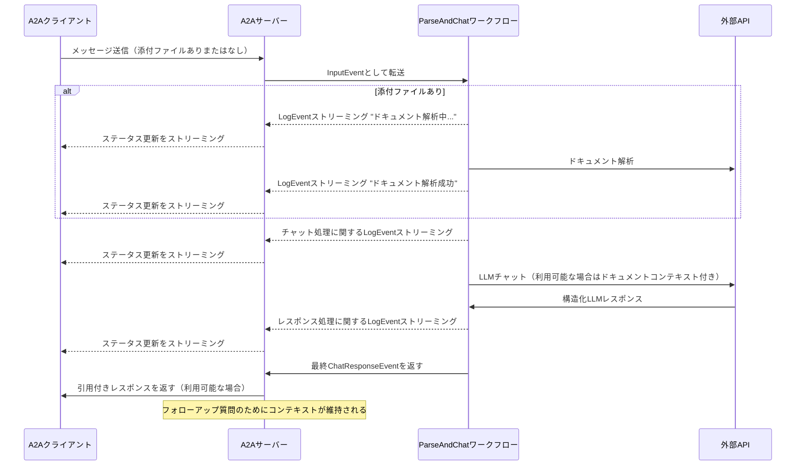

このサンプルは、[LlamaIndex Workflows](https://docs.llamaindex.ai/en/stable/understanding/workflows/)で構築され、A2Aプロトコルを通じて公開される会話エージェントを実演します。ファイルアップロードと解析、マルチターン対話をサポートする会話インタラクション、ストリーミングレスポンス/アップデート、インライン引用を紹介します。

## ソースコード
[a2a llama index file chat with openrouter](https://github.com/sing1ee/a2a_llama_index_file_chat)

## 動作原理

このエージェントは、LlamaIndex WorkflowsとOpenRouterを使用して、ファイルをアップロード、解析し、コンテンツに関する質問に答えることができる会話エージェントを提供します。A2Aプロトコルにより、エージェントとの標準化されたインタラクションが可能になり、クライアントがリクエストを送信してリアルタイムアップデートを受信できます。



## 主な機能

- **ファイルアップロード**：クライアントはファイルをアップロードして解析し、チャットにコンテキストを提供できます
- **マルチターン会話**：エージェントは必要に応じて追加情報を要求できます
- **リアルタイムストリーミング**：処理中にステータス更新を提供します
- **プッシュ通知**：Webhookベースの通知をサポートします
- **会話メモリ**：同一セッション内でのインタラクション間でコンテキストを維持します
- **LlamaParse統合**：LlamaParseを使用してファイルを正確に解析します

**注意：** このサンプルエージェントはマルチモーダル入力を受け入れますが、執筆時点では、サンプルUIはテキスト入力のみをサポートしています。UIは将来的にマルチモーダルになり、このケースや他のユースケースに対応する予定です。

## 前提条件

- Python 3.12以上
- [UV](https://docs.astral.sh/uv/)
- LLMとAPIキーへのアクセス（現在のコードはOpenRouter APIの使用を想定）
- LlamaParse APIキー（[無料で取得](https://cloud.llamaindex.ai)）

## セットアップと実行

1. プロジェクトディレクトリをクローンして移動：

   ```bash
   git clone https://github.com/sing1ee/a2a_llama_index_file_chat
   cd a2a_llama_index_file_chat
   ```

2. 仮想環境を作成して依存関係をインストール：

   ```bash
   uv venv
   uv sync
   ```

3. APIキーを含む環境ファイルを作成：

   ```bash
   echo "OPENROUTER_API_KEY=your_api_key_here" >> .env
   echo "LLAMA_CLOUD_API_KEY=your_api_key_here" >> .env
   ```

   **APIキーの取得：**
   - **OpenRouter APIキー**：[https://openrouter.ai](https://openrouter.ai)でサインアップして無料APIキーを取得
   - **LlamaCloud APIキー**：[https://cloud.llamaindex.ai](https://cloud.llamaindex.ai)で無料で取得

4. エージェントを実行：

   ```bash
   # uvを使用
   uv run a2a-file-chat

   # または仮想環境をアクティベートして直接実行
   source .venv/bin/activate  # Windows: .venv\Scripts\activate
   python -m a2a_file_chat

   # カスタムホスト/ポートで実行
   uv run a2a-file-chat --host 0.0.0.0 --port 8080
   ```

4. 別のターミナルでA2AクライアントCLIを実行：

  解析するファイルをダウンロードするか、独自のファイルにリンクします。例：

   ```bash
   curl -L https://arxiv.org/pdf/1706.03762 -o attention.pdf
   ```

   ```bash
   git clone https://github.com/google-a2a/a2a-samples.git
   cd a2a-samples/samples/python/hosts/cli
   uv run . --agent http://localhost:10010
   ```

   そして以下のような内容を入力：

   ```bash
   ======= Agent Card ========
   {"name":"Parse and Chat","description":"Parses a file and then chats with a user using the parsed content as context.","url":"http://localhost:10010/","version":"1.0.0","capabilities":{"streaming":true,"pushNotifications":true,"stateTransitionHistory":false},"defaultInputModes":["text","text/plain"],"defaultOutputModes":["text","text/plain"],"skills":[{"id":"parse_and_chat","name":"Parse and Chat","description":"Parses a file and then chats with a user using the parsed content as context.","tags":["parse","chat","file","llama_parse"],"examples":["What does this file talk about?"]}]}
   =========  starting a new task ======== 

   What do you want to send to the agent? (:q or quit to exit): このファイルは何について書かれていますか？
   Select a file path to attach? (press enter to skip): ./attention.pdf
   ```

## 技術実装

- **LlamaIndex Workflows**：ファイルを解析してからユーザーとチャットするカスタムワークフローを使用
- **ストリーミングサポート**：処理中に増分更新を提供
- **シリアライズ可能なコンテキスト**：ターン間で会話状態を維持、オプションでredis、mongodb、ディスクなどに永続化可能
- **プッシュ通知システム**：JWK認証付きのWebhookベース更新
- **A2Aプロトコル統合**：A2A仕様への完全準拠

## 制限事項

- テキストベースの出力のみサポート
- LlamaParseは最初の10Kクレジットまで無料（基本設定で約3333ページ）
- メモリはセッションベースでインメモリのため、サーバー再起動間で永続化されません
- ドキュメント全体をコンテキストウィンドウに挿入することは、大きなファイルに対してスケーラブルではありません。効果的なRAGのために、ベクターDBをデプロイするか、クラウドDBを使用して1つ以上のファイルに対して検索を実行することをお勧めします。LlamaIndexは[多数のベクターDBとクラウドDB](https://docs.llamaindex.ai/en/stable/examples/#vector-stores)と統合されています。

## 例

**同期リクエスト**

リクエスト：

```
POST http://localhost:10010
Content-Type: application/json

{
  "jsonrpc": "2.0",
  "id": 11,
  "method": "tasks/send",
  "params": {
    "id": "129",
    "sessionId": "8f01f3d172cd4396a0e535ae8aec6687",
    "acceptedOutputModes": [
      "text"
    ],
    "message": {
      "role": "user",
      "parts": [
        {
          "type": "text",
          "text": "このファイルは何について書かれていますか？"
        },
        {
            "type": "file",
            "file": {
                "bytes": "...",
                "name": "attention.pdf"
            }
        }
      ]
    }
  }
}
```

レスポンス：

```
{
  "jsonrpc": "2.0",
  "id": 11,
  "result": {
    "id": "129",
    "status": {
      "state": "completed",
      "timestamp": "2025-04-02T16:53:29.301828"
    },
    "artifacts": [
      {
        "parts": [
          {
            "type": "text",
            "text": "このファイルはXYZについて... [1]"
          }
        ],
        "metadata": {
            "1": ["引用1のテキスト"]
        }
        "index": 0,
      }
    ],
  }
}
```

**マルチターンの例**

リクエスト - シーケンス1：

```
POST http://localhost:10010
Content-Type: application/json

{
  "jsonrpc": "2.0",
  "id": 11,
  "method": "tasks/send",
  "params": {
    "id": "129",
    "sessionId": "8f01f3d172cd4396a0e535ae8aec6687",
    "acceptedOutputModes": [
      "text"
    ],
    "message": {
      "role": "user",
      "parts": [
        {
          "type": "text",
          "text": "このファイルは何について書かれていますか？"
        },
        {
            "type": "file",
            "file": {
                "bytes": "...",
                "name": "attention.pdf"
            }
        }
      ]
    }
  }
}
```

レスポンス - シーケンス2：

```
{
  "jsonrpc": "2.0",
  "id": 11,
  "result": {
    "id": "129",
    "status": {
      "state": "completed",
      "timestamp": "2025-04-02T16:53:29.301828"
    },
    "artifacts": [
      {
        "parts": [
          {
            "type": "text",
            "text": "このファイルはXYZについて... [1]"
          }
        ],
        "metadata": {
            "1": ["引用1のテキスト"]
        }
        "index": 0,
      }
    ],
  }
}
```

リクエスト - シーケンス3：

```
POST http://localhost:10010
Content-Type: application/json

{
  "jsonrpc": "2.0",
  "id": 11,
  "method": "tasks/send",
  "params": {
    "id": "130",
    "sessionId": "8f01f3d172cd4396a0e535ae8aec6687",
    "acceptedOutputModes": [
      "text"
    ],
    "message": {
      "role": "user",
      "parts": [
        {
          "type": "text",
          "text": "Xについてはどうですか？"
        }
      ]
    }
  }
}
```

レスポンス - シーケンス4：

```
{
  "jsonrpc": "2.0",
  "id": 11,
  "result": {
    "id": "130",
    "status": {
      "state": "completed",
      "timestamp": "2025-04-02T16:53:29.301828"
    },
    "artifacts": [
      {
        "parts": [
          {
            "type": "text",
            "text": "Xは... [1]"
          }
        ],
        "metadata": {
            "1": ["引用1のテキスト"]
        }
        "index": 0,
      }
    ],
  }
}
```

**ストリーミングの例**

リクエスト：

```
{
  "jsonrpc": "2.0",
  "id": 11,
  "method": "tasks/send",
  "params": {
    "id": "129",
    "sessionId": "8f01f3d172cd4396a0e535ae8aec6687",
    "acceptedOutputModes": [
      "text"
    ],
    "message": {
      "role": "user",
      "parts": [
        {
          "type": "text",
          "text": "このファイルは何について書かれていますか？"
        },
        {
            "type": "file",
            "file": {
                "bytes": "...",
                "name": "attention.pdf"
            }
        }
      ]
    }
  }
}
```

レスポンス：

```
stream event => {"jsonrpc":"2.0","id":"367d0ba9af97457890261ac29a0f6f5b","result":{"id":"373b26d64c5a4f0099fa906c6b7342d9","status":{"state":"working","message":{"role":"agent","parts":[{"type":"text","text":"ドキュメント解析中..."}]},"timestamp":"2025-04-15T16:05:18.283682"},"final":false}}

stream event => {"jsonrpc":"2.0","id":"367d0ba9af97457890261ac29a0f6f5b","result":{"id":"373b26d64c5a4f0099fa906c6b7342d9","status":{"state":"working","message":{"role":"agent","parts":[{"type":"text","text":"ドキュメント解析が成功しました。"}]},"timestamp":"2025-04-15T16:05:24.200133"},"final":false}}

stream event => {"jsonrpc":"2.0","id":"367d0ba9af97457890261ac29a0f6f5b","result":{"id":"373b26d64c5a4f0099fa906c6b7342d9","status":{"state":"working","message":{"role":"agent","parts":[{"type":"text","text":"1つの初期メッセージでチャット中。"}]},"timestamp":"2025-04-15T16:05:24.204757"},"final":false}}

stream event => {"jsonrpc":"2.0","id":"367d0ba9af97457890261ac29a0f6f5b","result":{"id":"373b26d64c5a4f0099fa906c6b7342d9","status":{"state":"working","message":{"role":"agent","parts":[{"type":"text","text":"システムプロンプトを挿入中..."}]},"timestamp":"2025-04-15T16:05:24.204810"},"final":false}}

stream event => {"jsonrpc":"2.0","id":"367d0ba9af97457890261ac29a0f6f5b","result":{"id":"373b26d64c5a4f0099fa906c6b7342d9","status":{"state":"working","message":{"role":"agent","parts":[{"type":"text","text":"LLMレスポンスを受信、引用を解析中..."}]},"timestamp":"2025-04-15T16:05:26.084829"},"final":false}}

stream event => {"jsonrpc":"2.0","id":"367d0ba9af97457890261ac29a0f6f5b","result":{"id":"373b26d64c5a4f0099fa906c6b7342d9","artifact":{"parts":[{"type":"text","text":"このファイルは、注意機構のみに基づく新しいニューラルネットワークアーキテクチャであるTransformerについて論じており、再帰と畳み込みを完全に排除しています[1]。この文書では、Transformerを再帰層と畳み込み層と比較し[2]、モデルアーキテクチャを詳述し[3]、機械翻訳と英語構文解析タスクの結果を示しています[4]。"}],"metadata":{"1":["主流のシーケンス変換モデルは、エンコーダーとデコーダーを含む複雑な再帰または畳み込みニューラルネットワークに基づいています。最高性能のモデルは、注意機構を通じてエンコーダーとデコーダーを接続しています。我々は、注意機構のみに基づく新しいシンプルなネットワークアーキテクチャであるTransformerを提案し、再帰と畳み込みを完全に排除しています。2つの機械翻訳タスクでの実験により、これらのモデルは品質において優れており、より並列化可能で、訓練に要する時間が大幅に短いことが示されました。我々のモデルは、WMT 2014英独翻訳タスクで28.4 BLEUを達成し、アンサンブルを含む既存の最良結果を2 BLEU以上上回りました。WMT 2014英仏翻訳タスクでは、我々のモデルは8つのGPUで3.5日間訓練した後、新しい単一モデル最先端BLEUスコア41.8を確立し、これは文献の最良モデルの訓練コストのわずかな部分です。我々は、大規模および限定的な訓練データの両方で英語構文解析に成功適用することにより、Transformerが他のタスクによく汎化することを示しています。"],"2":["このセクションでは、可変長シンボル表現シーケンス(x1, ..., xn)を等長の別のシーケンス(z1, ..., zn)にマッピングするために一般的に使用される再帰層と畳み込み層と、自己注意層の様々な側面を比較します。ここで、xi, zi ∈ Rdであり、典型的なシーケンス変換エンコーダーまたはデコーダーの隠れ層のようなものです。自己注意の使用を動機づけるために、3つの要求事項を考慮します。",""],"3":["# 3 モデルアーキテクチャ"],"4":["# 6   結果"]},"index":0,"append":false}}}

stream event => {"jsonrpc":"2.0","id":"367d0ba9af97457890261ac29a0f6f5b","result":{"id":"373b26d64c5a4f0099fa906c6b7342d9","status":{"state":"completed","timestamp":"2025-04-15T16:05:26.111314"},"final":true}}
```

ワークフローがインライン引用付きのアーティファクトを生成し、これらの引用のソーステキストがアーティファクトのメタデータに含まれていることがわかります。同じセッションでより多くのレスポンスを送信すると、エージェントは以前のメッセージを記憶して会話を続けます。

## 詳細情報

- [A2Aプロトコルドキュメント](https://google.github.io/A2A/#/documentation)
- [LlamaIndex Workflowドキュメント](https://docs.llamaindex.ai/en/stable/understanding/workflows/)
- [LlamaIndex Workflow例](https://docs.llamaindex.ai/en/stable/examples/#agentic-workflows)
- [LlamaParseドキュメント](https://github.com/run-llama/llama_cloud_services/blob/main/parse.md)
- [OpenRouter API](https://openrouter.ai)