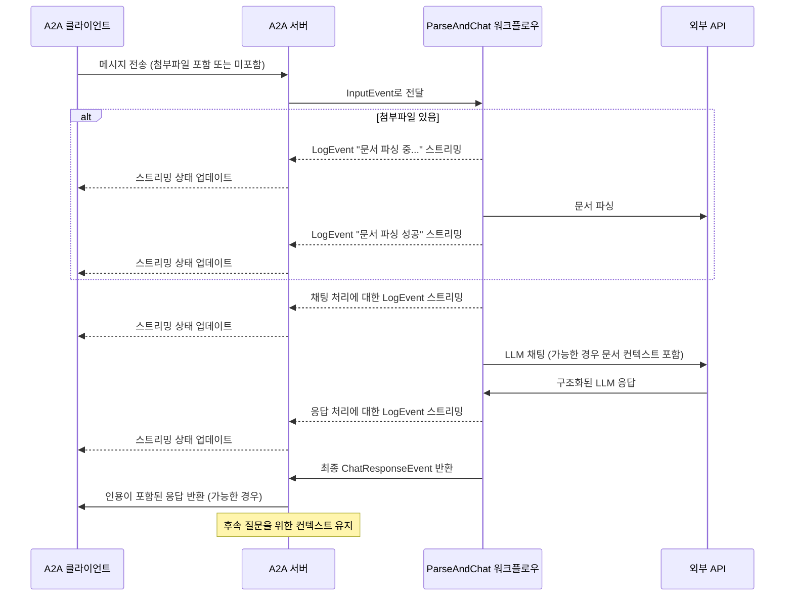

이 예제는 [LlamaIndex Workflows](https://docs.llamaindex.ai/en/stable/understanding/workflows/)를 사용하여 구축되고 A2A 프로토콜을 통해 노출되는 대화 에이전트를 보여줍니다. 파일 업로드 및 파싱, 다중 턴 대화를 지원하는 대화 상호작용, 스트리밍 응답/업데이트, 인라인 인용을 시연합니다.

## 소스 코드
[a2a llama index file chat with openrouter](https://github.com/sing1ee/a2a_llama_index_file_chat)

## 작동 원리

이 에이전트는 LlamaIndex Workflows와 OpenRouter를 사용하여 파일을 업로드하고, 파일을 파싱하며, 내용에 대한 질문에 답변할 수 있는 대화 에이전트를 제공합니다. A2A 프로토콜은 에이전트와의 표준화된 상호작용을 구현하여 클라이언트가 요청을 보내고 실시간 업데이트를 받을 수 있게 합니다.



## 주요 기능

- **파일 업로드**: 클라이언트가 파일을 업로드하고 채팅을 위한 컨텍스트로 파싱할 수 있습니다
- **다중 턴 대화**: 에이전트가 필요시 추가 정보를 요청할 수 있습니다
- **실시간 스트리밍**: 처리 중 상태 업데이트를 제공합니다
- **푸시 알림**: 웹훅 기반 알림을 지원합니다
- **대화 메모리**: 동일한 세션 내에서 상호작용 간 컨텍스트를 유지합니다
- **LlamaParse 통합**: LlamaParse를 사용하여 정확한 파일 파싱을 수행합니다

**참고:** 이 예제 에이전트는 다중 모달 입력을 허용하지만, 이 글을 작성하는 시점에서 예제 UI는 텍스트 입력만 지원합니다. UI는 향후 이 사용 사례와 다른 사용 사례를 처리하기 위해 다중 모달로 변경될 예정입니다.

## 전제 조건

- Python 3.12 이상
- [UV](https://docs.astral.sh/uv/)
- LLM 및 API 키 액세스 (현재 코드는 OpenRouter API 사용을 가정)
- LlamaParse API 키 ([무료로 받기](https://cloud.llamaindex.ai))

## 설정 및 실행

1. 프로젝트 디렉토리를 클론하고 이동:

   ```bash
   git clone https://github.com/sing1ee/a2a_llama_index_file_chat
   cd a2a_llama_index_file_chat
   ```

2. 가상 환경을 생성하고 의존성을 설치:

   ```bash
   uv venv
   uv sync
   ```

3. API 키로 환경 파일 생성:

   ```bash
   echo "OPENROUTER_API_KEY=your_api_key_here" >> .env
   echo "LLAMA_CLOUD_API_KEY=your_api_key_here" >> .env
   ```

   **API 키 받기:**
   - **OpenRouter API 키**: [https://openrouter.ai](https://openrouter.ai)에서 가입하여 무료 API 키를 받으세요
   - **LlamaCloud API 키**: [https://cloud.llamaindex.ai](https://cloud.llamaindex.ai)에서 무료로 받으세요

4. 에이전트 실행:

   ```bash
   # uv 사용
   uv run a2a-file-chat

   # 또는 가상 환경을 활성화하고 직접 실행
   source .venv/bin/activate  # Windows: .venv\Scripts\activate
   python -m a2a_file_chat

   # 사용자 정의 호스트/포트 사용
   uv run a2a-file-chat --host 0.0.0.0 --port 8080
   ```

4. 별도의 터미널에서 A2A 클라이언트 CLI 실행:

  파싱할 파일을 다운로드하거나 자신의 파일에 링크하세요. 예를 들어:

   ```bash
   curl -L https://arxiv.org/pdf/1706.03762 -o attention.pdf
   ```

   ```bash
   git clone https://github.com/google-a2a/a2a-samples.git
   cd a2a-samples/samples/python/hosts/cli
   uv run . --agent http://localhost:10010
   ```

   그런 다음 다음과 같은 내용을 입력하세요:

   ```bash
   ======= Agent Card ========
   {"name":"Parse and Chat","description":"Parses a file and then chats with a user using the parsed content as context.","url":"http://localhost:10010/","version":"1.0.0","capabilities":{"streaming":true,"pushNotifications":true,"stateTransitionHistory":false},"defaultInputModes":["text","text/plain"],"defaultOutputModes":["text","text/plain"],"skills":[{"id":"parse_and_chat","name":"Parse and Chat","description":"Parses a file and then chats with a user using the parsed content as context.","tags":["parse","chat","file","llama_parse"],"examples":["What does this file talk about?"]}]}
   =========  starting a new task ======== 

   What do you want to send to the agent? (:q or quit to exit): 이 파일은 무엇에 대해 이야기하나요?
   Select a file path to attach? (press enter to skip): ./attention.pdf
   ```

## 기술 구현

- **LlamaIndex Workflows**: 파일을 파싱한 후 사용자와 채팅하는 사용자 정의 워크플로우 사용
- **스트리밍 지원**: 처리 중 증분 업데이트 제공
- **직렬화 가능한 컨텍스트**: 턴 간 대화 상태 유지, 선택적으로 redis, mongodb, 디스크 등에 지속
- **푸시 알림 시스템**: JWK 인증을 통한 웹훅 기반 업데이트
- **A2A 프로토콜 통합**: A2A 사양을 완전히 준수

## 제한사항

- 텍스트 기반 출력만 지원
- LlamaParse 첫 10K 크레딧 무료 (기본 설정으로 약 3333페이지)
- 메모리는 세션 기반이며 메모리에 있으므로 서버 재시작 간에 지속되지 않음
- 전체 문서를 컨텍스트 창에 삽입하는 것은 큰 파일에 대해 확장 가능하지 않음. 효과적인 RAG를 위해 벡터 데이터베이스를 배포하거나 클라우드 데이터베이스를 사용하여 하나 이상의 파일에 대해 검색을 실행하는 것을 고려할 수 있습니다. LlamaIndex는 [다양한 벡터 데이터베이스 및 클라우드 데이터베이스](https://docs.llamaindex.ai/en/stable/examples/#vector-stores)와 통합됩니다.

## 예제

**동기 요청**

요청:

```
POST http://localhost:10010
Content-Type: application/json

{
  "jsonrpc": "2.0",
  "id": 11,
  "method": "tasks/send",
  "params": {
    "id": "129",
    "sessionId": "8f01f3d172cd4396a0e535ae8aec6687",
    "acceptedOutputModes": [
      "text"
    ],
    "message": {
      "role": "user",
      "parts": [
        {
          "type": "text",
          "text": "이 파일은 무엇에 대해 이야기하나요?"
        },
        {
            "type": "file",
            "file": {
                "bytes": "...",
                "name": "attention.pdf"
            }
        }
      ]
    }
  }
}
```

응답:

```
{
  "jsonrpc": "2.0",
  "id": 11,
  "result": {
    "id": "129",
    "status": {
      "state": "completed",
      "timestamp": "2025-04-02T16:53:29.301828"
    },
    "artifacts": [
      {
        "parts": [
          {
            "type": "text",
            "text": "이 파일은 XYZ에 대해 이야기합니다... [1]"
          }
        ],
        "metadata": {
            "1": ["인용 1의 텍스트"]
        }
        "index": 0,
      }
    ],
  }
}
```

**다중 턴 예제**

요청 - 시퀀스 1:

```
POST http://localhost:10010
Content-Type: application/json

{
  "jsonrpc": "2.0",
  "id": 11,
  "method": "tasks/send",
  "params": {
    "id": "129",
    "sessionId": "8f01f3d172cd4396a0e535ae8aec6687",
    "acceptedOutputModes": [
      "text"
    ],
    "message": {
      "role": "user",
      "parts": [
        {
          "type": "text",
          "text": "이 파일은 무엇에 대해 이야기하나요?"
        },
        {
            "type": "file",
            "file": {
                "bytes": "...",
                "name": "attention.pdf"
            }
        }
      ]
    }
  }
}
```

응답 - 시퀀스 2:

```
{
  "jsonrpc": "2.0",
  "id": 11,
  "result": {
    "id": "129",
    "status": {
      "state": "completed",
      "timestamp": "2025-04-02T16:53:29.301828"
    },
    "artifacts": [
      {
        "parts": [
          {
            "type": "text",
            "text": "이 파일은 XYZ에 대해 이야기합니다... [1]"
          }
        ],
        "metadata": {
            "1": ["인용 1의 텍스트"]
        }
        "index": 0,
      }
    ],
  }
}
```

요청 - 시퀀스 3:

```
POST http://localhost:10010
Content-Type: application/json

{
  "jsonrpc": "2.0",
  "id": 11,
  "method": "tasks/send",
  "params": {
    "id": "130",
    "sessionId": "8f01f3d172cd4396a0e535ae8aec6687",
    "acceptedOutputModes": [
      "text"
    ],
    "message": {
      "role": "user",
      "parts": [
        {
          "type": "text",
          "text": "그럼 X는 어떤가요?"
        }
      ]
    }
  }
}
```

응답 - 시퀀스 4:

```
{
  "jsonrpc": "2.0",
  "id": 11,
  "result": {
    "id": "130",
    "status": {
      "state": "completed",
      "timestamp": "2025-04-02T16:53:29.301828"
    },
    "artifacts": [
      {
        "parts": [
          {
            "type": "text",
            "text": "X는... [1]"
          }
        ],
        "metadata": {
            "1": ["인용 1의 텍스트"]
        }
        "index": 0,
      }
    ],
  }
}
```

**스트리밍 예제**

요청:

```
{
  "jsonrpc": "2.0",
  "id": 11,
  "method": "tasks/send",
  "params": {
    "id": "129",
    "sessionId": "8f01f3d172cd4396a0e535ae8aec6687",
    "acceptedOutputModes": [
      "text"
    ],
    "message": {
      "role": "user",
      "parts": [
        {
          "type": "text",
          "text": "이 파일은 무엇에 대해 이야기하나요?"
        },
        {
            "type": "file",
            "file": {
                "bytes": "...",
                "name": "attention.pdf"
            }
        }
      ]
    }
  }
}
```

응답:

```
stream event => {"jsonrpc":"2.0","id":"367d0ba9af97457890261ac29a0f6f5b","result":{"id":"373b26d64c5a4f0099fa906c6b7342d9","status":{"state":"working","message":{"role":"agent","parts":[{"type":"text","text":"문서 파싱 중..."}]},"timestamp":"2025-04-15T16:05:18.283682"},"final":false}}

stream event => {"jsonrpc":"2.0","id":"367d0ba9af97457890261ac29a0f6f5b","result":{"id":"373b26d64c5a4f0099fa906c6b7342d9","status":{"state":"working","message":{"role":"agent","parts":[{"type":"text","text":"문서 파싱 성공."}]},"timestamp":"2025-04-15T16:05:24.200133"},"final":false}}

stream event => {"jsonrpc":"2.0","id":"367d0ba9af97457890261ac29a0f6f5b","result":{"id":"373b26d64c5a4f0099fa906c6b7342d9","status":{"state":"working","message":{"role":"agent","parts":[{"type":"text","text":"1개의 초기 메시지로 채팅 중."}]},"timestamp":"2025-04-15T16:05:24.204757"},"final":false}}

stream event => {"jsonrpc":"2.0","id":"367d0ba9af97457890261ac29a0f6f5b","result":{"id":"373b26d64c5a4f0099fa906c6b7342d9","status":{"state":"working","message":{"role":"agent","parts":[{"type":"text","text":"시스템 프롬프트 삽입 중..."}]},"timestamp":"2025-04-15T16:05:24.204810"},"final":false}}

stream event => {"jsonrpc":"2.0","id":"367d0ba9af97457890261ac29a0f6f5b","result":{"id":"373b26d64c5a4f0099fa906c6b7342d9","status":{"state":"working","message":{"role":"agent","parts":[{"type":"text","text":"LLM 응답을 받았습니다. 인용을 파싱 중..."}]},"timestamp":"2025-04-15T16:05:26.084829"},"final":false}}

stream event => {"jsonrpc":"2.0","id":"367d0ba9af97457890261ac29a0f6f5b","result":{"id":"373b26d64c5a4f0099fa906c6b7342d9","artifact":{"parts":[{"type":"text","text":"이 파일은 Transformer에 대해 논의합니다. 이는 순환과 합성곱을 완전히 배제하고 오직 어텐션 메커니즘에만 기반한 새로운 신경망 아키텍처입니다 [1]. 이 문서는 Transformer를 순환 및 합성곱 레이어와 비교하고 [2], 모델 아키텍처를 자세히 설명하며 [3], 기계 번역 및 영어 구문 분석 작업의 결과를 제시합니다 [4]."}],"metadata":{"1":["주요 시퀀스 변환 모델은 인코더와 디코더를 포함하는 복잡한 순환 또는 합성곱 신경망을 기반으로 합니다. 최고 성능의 모델은 또한 어텐션 메커니즘을 통해 인코더와 디코더를 연결합니다. 우리는 순환과 합성곱을 완전히 배제하고 오직 어텐션 메커니즘에만 기반한 새로운 간단한 네트워크 아키텍처인 Transformer를 제안합니다. 두 기계 번역 작업에 대한 실험은 이러한 모델이 품질면에서 우수하면서도 더 병렬화 가능하고 훈련에 필요한 시간이 현저히 적음을 보여줍니다. 우리 모델은 WMT 2014 영어-독일어 번역 작업에서 28.4 BLEU를 달성하여 앙상블을 포함한 기존 최고 결과를 2 BLEU 이상 개선했습니다. WMT 2014 영어-프랑스어 번역 작업에서 우리 모델은 8개의 GPU에서 3.5일 훈련 후 새로운 단일 모델 최첨단 BLEU 점수 41.8을 달성했으며, 이는 문헌의 최고 모델 훈련 비용의 일부에 불과합니다. 우리는 Transformer가 대규모 및 제한된 훈련 데이터 모두에서 영어 구문 분석에 성공적으로 적용함으로써 다른 작업에도 잘 일반화됨을 보여줍니다."],"2":["이 섹션에서 우리는 일반적으로 하나의 가변 길이 기호 표현 시퀀스 (x1, ..., xn)을 동일한 길이의 다른 시퀀스 (z1, ..., zn)로 매핑하는 데 사용되는 순환 및 합성곱 레이어와 자기 어텐션 레이어의 다양한 측면을 비교합니다. 여기서 xi, zi ∈ Rd이며, 이는 일반적인 시퀀스 변환 인코더 또는 디코더의 숨겨진 레이어와 같습니다. 자기 어텐션 사용을 동기화하기 위해 우리는 세 가지 요구사항을 고려합니다.",""],"3":["# 3 모델 아키텍처"],"4":["# 6   결과"]}},"index":0,"append":false}}

stream event => {"jsonrpc":"2.0","id":"367d0ba9af97457890261ac29a0f6f5b","result":{"id":"373b26d64c5a4f0099fa906c6b7342d9","status":{"state":"completed","timestamp":"2025-04-15T16:05:26.111314"},"final":true}}
```

워크플로우가 인라인 인용이 포함된 아티팩트를 생성하는 것을 볼 수 있으며, 이러한 인용의 소스 텍스트는 아티팩트의 메타데이터에 포함됩니다. 동일한 세션에서 더 많은 응답을 보내면 에이전트는 이전 메시지를 기억하고 대화를 계속합니다.

## 더 알아보기

- [A2A 프로토콜 문서](https://google.github.io/A2A/#/documentation)
- [LlamaIndex Workflow 문서](https://docs.llamaindex.ai/en/stable/understanding/workflows/)
- [LlamaIndex Workflow 예제](https://docs.llamaindex.ai/en/stable/examples/#agentic-workflows)
- [LlamaParse 문서](https://github.com/run-llama/llama_cloud_services/blob/main/parse.md)
- [OpenRouter API](https://openrouter.ai)
- [LlamaIndex File Chat Agent](https://github.com/sing1ee/a2a_llama_index_file_chat)
- [A2A Python Demo](https://a2aprotocol.ai/blog/a2a-samples-llama-index-file-chat-openrouter-ko)