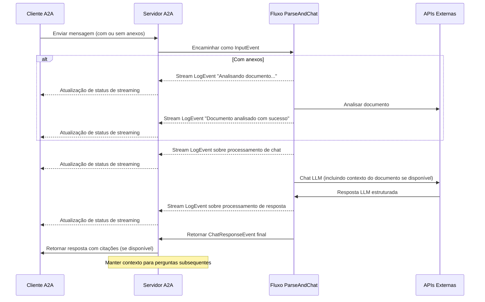

Este exemplo demonstra um agente conversacional construído usando [LlamaIndex Workflows](https://docs.llamaindex.ai/en/stable/understanding/workflows/) e exposto através do protocolo A2A. Ele mostra upload e análise de arquivos, interação conversacional com suporte a conversas multi-turno, respostas/atualizações de streaming e citações inline.

## Código Fonte
[a2a llama index file chat with openrouter](https://github.com/sing1ee/a2a_llama_index_file_chat)

## Como Funciona

O agente usa LlamaIndex Workflows com OpenRouter para fornecer um agente conversacional que pode fazer upload de arquivos, analisar arquivos e responder perguntas sobre o conteúdo. O protocolo A2A permite interação padronizada com o agente, permitindo que clientes enviem solicitações e recebam atualizações em tempo real.



## Principais Recursos

- **Upload de Arquivos**: Clientes podem fazer upload de arquivos e analisá-los para fornecer contexto para o chat
- **Conversas Multi-turno**: O agente pode solicitar informações adicionais quando necessário
- **Streaming em Tempo Real**: Fornece atualizações de status durante o processamento
- **Notificações Push**: Suporte para notificações baseadas em webhook
- **Memória Conversacional**: Mantém contexto entre interações na mesma sessão
- **Integração LlamaParse**: Usa LlamaParse para análise precisa de arquivos

**Nota:** Este agente de exemplo aceita entrada multimodal, mas no momento da escrita, a UI de exemplo suporta apenas entrada de texto. A UI se tornará multimodal no futuro para lidar com este caso de uso e outros.

## Pré-requisitos

- Python 3.12 ou superior
- [UV](https://docs.astral.sh/uv/)
- Acesso a LLM e chaves de API (o código atual assume uso da API OpenRouter)
- Chave de API LlamaParse ([obtenha gratuitamente](https://cloud.llamaindex.ai))

## Configuração e Execução

1. Clone e navegue para o diretório do projeto:

   ```bash
   git clone https://github.com/sing1ee/a2a_llama_index_file_chat
   cd a2a_llama_index_file_chat
   ```

2. Crie um ambiente virtual e instale dependências:

   ```bash
   uv venv
   uv sync
   ```

3. Crie um arquivo de ambiente com suas chaves de API:

   ```bash
   echo "OPENROUTER_API_KEY=your_api_key_here" >> .env
   echo "LLAMA_CLOUD_API_KEY=your_api_key_here" >> .env
   ```

   **Obter Chaves de API:**
   - **Chave de API OpenRouter**: Registre-se em [https://openrouter.ai](https://openrouter.ai) para obter uma chave de API gratuita
   - **Chave de API LlamaCloud**: Obtenha gratuitamente em [https://cloud.llamaindex.ai](https://cloud.llamaindex.ai)

4. Execute o agente:

   ```bash
   # Usando uv
   uv run a2a-file-chat

   # Ou ative o ambiente virtual e execute diretamente
   source .venv/bin/activate  # No Windows: .venv\Scripts\activate
   python -m a2a_file_chat

   # Usando host/porta personalizada
   uv run a2a-file-chat --host 0.0.0.0 --port 8080
   ```

4. Em um terminal separado, execute o CLI do cliente A2A:

  Baixe um arquivo para analisar, ou vincule ao seu próprio arquivo. Por exemplo:

   ```bash
   curl -L https://arxiv.org/pdf/1706.03762 -o attention.pdf
   ```

   ```bash
   git clone https://github.com/google-a2a/a2a-samples.git
   cd a2a-samples/samples/python/hosts/cli
   uv run . --agent http://localhost:10010
   ```

   Em seguida, digite algo como:

   ```bash
   ======= Agent Card ========
   {"name":"Parse and Chat","description":"Parses a file and then chats with a user using the parsed content as context.","url":"http://localhost:10010/","version":"1.0.0","capabilities":{"streaming":true,"pushNotifications":true,"stateTransitionHistory":false},"defaultInputModes":["text","text/plain"],"defaultOutputModes":["text","text/plain"],"skills":[{"id":"parse_and_chat","name":"Parse and Chat","description":"Parses a file and then chats with a user using the parsed content as context.","tags":["parse","chat","file","llama_parse"],"examples":["What does this file talk about?"]}]}
   =========  starting a new task ======== 

   What do you want to send to the agent? (:q or quit to exit): Sobre o que fala este arquivo?
   Select a file path to attach? (press enter to skip): ./attention.pdf
   ```

## Implementação Técnica

- **LlamaIndex Workflows**: Usa fluxo de trabalho personalizado para analisar arquivos e depois conversar com o usuário
- **Suporte a Streaming**: Fornece atualizações incrementais durante o processamento
- **Contexto Serializável**: Mantém estado conversacional entre turnos, opcionalmente persistindo para redis, mongodb, disco, etc.
- **Sistema de Notificações Push**: Atualizações baseadas em webhook com autenticação JWK
- **Integração do Protocolo A2A**: Totalmente compatível com a especificação A2A

## Limitações

- Suporta apenas saída baseada em texto
- LlamaParse oferece 10K créditos gratuitos (aproximadamente 3333 páginas na configuração básica)
- Memória baseada em sessão e em memória, então não persiste entre reinicializações do servidor
- Inserir todo o documento na janela de contexto não é escalável para arquivos maiores. Você pode querer implantar um banco de dados vetorial ou usar um banco de dados em nuvem para executar recuperação em um ou mais arquivos para RAG eficaz. LlamaIndex integra com [muitos bancos de dados vetoriais e em nuvem](https://docs.llamaindex.ai/en/stable/examples/#vector-stores).

## Exemplos

**Solicitação Síncrona**

Solicitação:

```
POST http://localhost:10010
Content-Type: application/json

{
  "jsonrpc": "2.0",
  "id": 11,
  "method": "tasks/send",
  "params": {
    "id": "129",
    "sessionId": "8f01f3d172cd4396a0e535ae8aec6687",
    "acceptedOutputModes": [
      "text"
    ],
    "message": {
      "role": "user",
      "parts": [
        {
          "type": "text",
          "text": "Sobre o que fala este arquivo?"
        },
        {
            "type": "file",
            "file": {
                "bytes": "...",
                "name": "attention.pdf"
            }
        }
      ]
    }
  }
}
```

Resposta:

```
{
  "jsonrpc": "2.0",
  "id": 11,
  "result": {
    "id": "129",
    "status": {
      "state": "completed",
      "timestamp": "2025-04-02T16:53:29.301828"
    },
    "artifacts": [
      {
        "parts": [
          {
            "type": "text",
            "text": "Este arquivo fala sobre XYZ... [1]"
          }
        ],
        "metadata": {
            "1": ["Texto da citação 1"]
        }
        "index": 0,
      }
    ],
  }
}
```

**Exemplo Multi-turno**

Solicitação - Sequência 1:

```
POST http://localhost:10010
Content-Type: application/json

{
  "jsonrpc": "2.0",
  "id": 11,
  "method": "tasks/send",
  "params": {
    "id": "129",
    "sessionId": "8f01f3d172cd4396a0e535ae8aec6687",
    "acceptedOutputModes": [
      "text"
    ],
    "message": {
      "role": "user",
      "parts": [
        {
          "type": "text",
          "text": "Sobre o que fala este arquivo?"
        },
        {
            "type": "file",
            "file": {
                "bytes": "...",
                "name": "attention.pdf"
            }
        }
      ]
    }
  }
}
```

Resposta - Sequência 2:

```
{
  "jsonrpc": "2.0",
  "id": 11,
  "result": {
    "id": "129",
    "status": {
      "state": "completed",
      "timestamp": "2025-04-02T16:53:29.301828"
    },
    "artifacts": [
      {
        "parts": [
          {
            "type": "text",
            "text": "Este arquivo fala sobre XYZ... [1]"
          }
        ],
        "metadata": {
            "1": ["Texto da citação 1"]
        }
        "index": 0,
      }
    ],
  }
}
```

Solicitação - Sequência 3:

```
POST http://localhost:10010
Content-Type: application/json

{
  "jsonrpc": "2.0",
  "id": 11,
  "method": "tasks/send",
  "params": {
    "id": "130",
    "sessionId": "8f01f3d172cd4396a0e535ae8aec6687",
    "acceptedOutputModes": [
      "text"
    ],
    "message": {
      "role": "user",
      "parts": [
        {
          "type": "text",
          "text": "E sobre a coisa X?"
        }
      ]
    }
  }
}
```

Resposta - Sequência 4:

```
{
  "jsonrpc": "2.0",
  "id": 11,
  "result": {
    "id": "130",
    "status": {
      "state": "completed",
      "timestamp": "2025-04-02T16:53:29.301828"
    },
    "artifacts": [
      {
        "parts": [
          {
            "type": "text",
            "text": "A coisa X é... [1]"
          }
        ],
        "metadata": {
            "1": ["Texto da citação 1"]
        }
        "index": 0,
      }
    ],
  }
}
```

**Exemplo de Streaming**

Solicitação:

```
{
  "jsonrpc": "2.0",
  "id": 11,
  "method": "tasks/send",
  "params": {
    "id": "129",
    "sessionId": "8f01f3d172cd4396a0e535ae8aec6687",
    "acceptedOutputModes": [
      "text"
    ],
    "message": {
      "role": "user",
      "parts": [
        {
          "type": "text",
          "text": "Sobre o que fala este arquivo?"
        },
        {
            "type": "file",
            "file": {
                "bytes": "...",
                "name": "attention.pdf"
            }
        }
      ]
    }
  }
}
```

Resposta:

```
stream event => {"jsonrpc":"2.0","id":"367d0ba9af97457890261ac29a0f6f5b","result":{"id":"373b26d64c5a4f0099fa906c6b7342d9","status":{"state":"working","message":{"role":"agent","parts":[{"type":"text","text":"Analisando documento..."}]},"timestamp":"2025-04-15T16:05:18.283682"},"final":false}}

stream event => {"jsonrpc":"2.0","id":"367d0ba9af97457890261ac29a0f6f5b","result":{"id":"373b26d64c5a4f0099fa906c6b7342d9","status":{"state":"working","message":{"role":"agent","parts":[{"type":"text","text":"Documento analisado com sucesso."}]},"timestamp":"2025-04-15T16:05:24.200133"},"final":false}}

stream event => {"jsonrpc":"2.0","id":"367d0ba9af97457890261ac29a0f6f5b","result":{"id":"373b26d64c5a4f0099fa906c6b7342d9","status":{"state":"working","message":{"role":"agent","parts":[{"type":"text","text":"Conversando com 1 mensagem inicial."}]},"timestamp":"2025-04-15T16:05:24.204757"},"final":false}}

stream event => {"jsonrpc":"2.0","id":"367d0ba9af97457890261ac29a0f6f5b","result":{"id":"373b26d64c5a4f0099fa906c6b7342d9","status":{"state":"working","message":{"role":"agent","parts":[{"type":"text","text":"Inserindo prompt do sistema..."}]},"timestamp":"2025-04-15T16:05:24.204810"},"final":false}}

stream event => {"jsonrpc":"2.0","id":"367d0ba9af97457890261ac29a0f6f5b","result":{"id":"373b26d64c5a4f0099fa906c6b7342d9","status":{"state":"working","message":{"role":"agent","parts":[{"type":"text","text":"Resposta LLM recebida, analisando citações..."}]},"timestamp":"2025-04-15T16:05:26.084829"},"final":false}}

stream event => {"jsonrpc":"2.0","id":"367d0ba9af97457890261ac29a0f6f5b","result":{"id":"373b26d64c5a4f0099fa906c6b7342d9","artifact":{"parts":[{"type":"text","text":"Este arquivo discute o Transformer, uma nova arquitetura de rede neural baseada inteiramente em mecanismos de atenção, dispensando completamente recorrência e convolução [1]. O documento compara o Transformer com camadas recorrentes e convolucionais [2], detalha a arquitetura do modelo [3], e mostra resultados para tarefas de tradução automática e análise sintática do inglês [4]."}],"metadata":{"1":["Os modelos de transdução de sequência dominantes são baseados em redes neurais recorrentes ou convolucionais complexas que incluem um codificador e um decodificador. Os modelos com melhor desempenho também conectam o codificador e decodificador através de um mecanismo de atenção. Propomos uma nova arquitetura de rede simples, o Transformer, baseada inteiramente em mecanismos de atenção, dispensando completamente recorrência e convolução. Experimentos em duas tarefas de tradução automática mostram que esses modelos são superiores em qualidade, sendo mais paralelizáveis e requerendo significativamente menos tempo para treinar. Nosso modelo alcança 28.4 BLEU na tarefa de tradução inglês-alemão WMT 2014, melhorando em mais de 2 BLEU os melhores resultados existentes, incluindo ensembles. Na tarefa de tradução inglês-francês WMT 2014, nosso modelo estabelece um novo estado da arte de BLEU de modelo único de 41.8 após treinamento por 3.5 dias em oito GPUs, uma pequena fração do custo de treinamento dos melhores modelos da literatura. Mostramos que o Transformer generaliza bem para outras tarefas aplicando-o com sucesso à análise sintática do inglês com dados de treinamento grandes e limitados."],"2":["Nesta seção, comparamos vários aspectos das camadas de auto-atenção com as camadas recorrentes e convolucionais comumente usadas para mapear uma sequência de representações simbólicas de comprimento variável (x1, ..., xn) para outra sequência de igual comprimento (z1, ..., zn) com xi, zi ∈ Rd, como uma camada oculta típica em um codificador ou decodificador de transdução de sequência. Motivando nosso uso de auto-atenção, consideramos três desejos.",""],"3":["# 3 Arquitetura do Modelo"],"4":["# 6   Resultados"]},"index":0,"append":false}}

stream event => {"jsonrpc":"2.0","id":"367d0ba9af97457890261ac29a0f6f5b","result":{"id":"373b26d64c5a4f0099fa906c6b7342d9","status":{"state":"completed","timestamp":"2025-04-15T16:05:26.111314"},"final":true}}
```

Você pode ver que o fluxo de trabalho produziu um artefato com citações inline, e o texto fonte dessas citações está incluído nos metadados do artefato. Se enviarmos mais respostas na mesma sessão, o agente lembrará das mensagens anteriores e continuará a conversa.

## Saiba Mais

- [Documentação do Protocolo A2A](https://google.github.io/A2A/#/documentation)
- [Documentação do LlamaIndex Workflow](https://docs.llamaindex.ai/en/stable/understanding/workflows/)
- [Exemplos do LlamaIndex Workflow](https://docs.llamaindex.ai/en/stable/examples/#agentic-workflows)
- [Documentação do LlamaParse](https://github.com/run-llama/llama_cloud_services/blob/main/parse.md)
- [API OpenRouter](https://openrouter.ai)