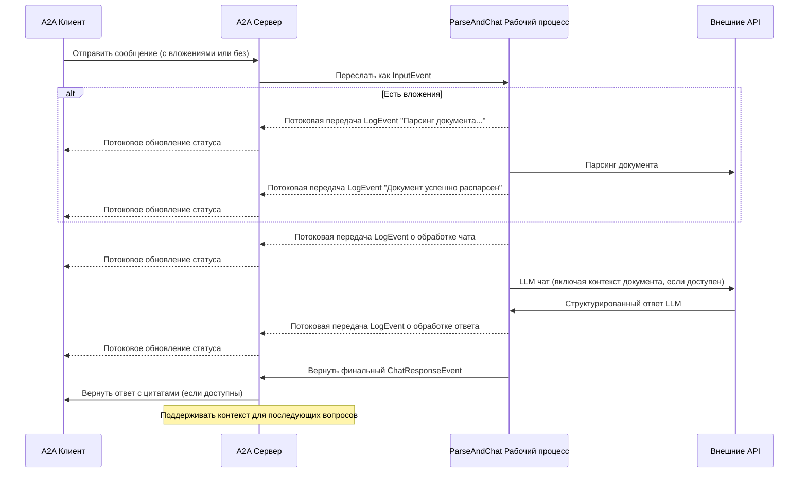

Этот пример демонстрирует разговорного агента, созданного с использованием [LlamaIndex Workflows](https://docs.llamaindex.ai/en/stable/understanding/workflows/) и предоставляемого через протокол A2A. Он демонстрирует загрузку и парсинг файлов, разговорное взаимодействие с поддержкой многооборотных диалогов, потоковые ответы/обновления и встроенные цитаты.

## Исходный код
[a2a llama index file chat with openrouter](https://github.com/sing1ee/a2a_llama_index_file_chat)

## Как это работает

Агент использует LlamaIndex Workflows с OpenRouter для предоставления разговорного агента, который может загружать файлы, парсить файлы и отвечать на вопросы о содержимом. Протокол A2A обеспечивает стандартизированное взаимодействие с агентом, позволяя клиентам отправлять запросы и получать обновления в реальном времени.



## Основные функции

- **Загрузка файлов**: Клиенты могут загружать файлы и парсить их для предоставления контекста для чата
- **Многооборотные разговоры**: Агент может запрашивать дополнительную информацию при необходимости
- **Потоковая передача в реальном времени**: Предоставляет обновления статуса во время обработки
- **Push-уведомления**: Поддерживает уведомления на основе webhook
- **Память разговора**: Поддерживает контекст между взаимодействиями в рамках одной сессии
- **Интеграция LlamaParse**: Использует LlamaParse для точного парсинга файлов

**Примечание:** Этот пример агента принимает мультимодальный ввод, но на момент написания пример UI поддерживает только текстовый ввод. UI станет мультимодальным в будущем для обработки этого и других случаев использования.

## Предварительные требования

- Python 3.12 или выше
- [UV](https://docs.astral.sh/uv/)
- Доступ к LLM и API ключи (текущий код предполагает использование OpenRouter API)
- API ключ LlamaParse ([получить бесплатно](https://cloud.llamaindex.ai))

## Настройка и запуск

1. Клонируйте и перейдите в директорию проекта:

   ```bash
   git clone https://github.com/sing1ee/a2a_llama_index_file_chat
   cd a2a_llama_index_file_chat
   ```

2. Создайте виртуальную среду и установите зависимости:

   ```bash
   uv venv
   uv sync
   ```

3. Создайте файл окружения с вашими API ключами:

   ```bash
   echo "OPENROUTER_API_KEY=your_api_key_here" >> .env
   echo "LLAMA_CLOUD_API_KEY=your_api_key_here" >> .env
   ```

   **Получение API ключей:**
   - **API ключ OpenRouter**: Зарегистрируйтесь на [https://openrouter.ai](https://openrouter.ai) для получения бесплатного API ключа
   - **API ключ LlamaCloud**: Получите бесплатно на [https://cloud.llamaindex.ai](https://cloud.llamaindex.ai)

4. Запустите агента:

   ```bash
   # Используя uv
   uv run a2a-file-chat

   # Или активируйте виртуальную среду и запустите напрямую
   source .venv/bin/activate  # На Windows: .venv\Scripts\activate
   python -m a2a_file_chat

   # Используя пользовательский хост/порт
   uv run a2a-file-chat --host 0.0.0.0 --port 8080
   ```

4. В отдельном терминале запустите A2A клиент CLI:

  Скачайте файл для парсинга или ссылку на ваш собственный файл. Например:

   ```bash
   curl -L https://arxiv.org/pdf/1706.03762 -o attention.pdf
   ```

   ```bash
   git clone https://github.com/google-a2a/a2a-samples.git
   cd a2a-samples/samples/python/hosts/cli
   uv run . --agent http://localhost:10010
   ```

   Затем введите что-то подобное:

   ```bash
   ======= Agent Card ========
   {"name":"Parse and Chat","description":"Parses a file and then chats with a user using the parsed content as context.","url":"http://localhost:10010/","version":"1.0.0","capabilities":{"streaming":true,"pushNotifications":true,"stateTransitionHistory":false},"defaultInputModes":["text","text/plain"],"defaultOutputModes":["text","text/plain"],"skills":[{"id":"parse_and_chat","name":"Parse and Chat","description":"Parses a file and then chats with a user using the parsed content as context.","tags":["parse","chat","file","llama_parse"],"examples":["What does this file talk about?"]}]}
   =========  starting a new task ======== 

   What do you want to send to the agent? (:q or quit to exit): О чем этот файл?
   Select a file path to attach? (press enter to skip): ./attention.pdf
   ```

## Техническая реализация

- **LlamaIndex Workflows**: Использует пользовательский рабочий процесс для парсинга файлов и последующего чата с пользователем
- **Поддержка потоковой передачи**: Предоставляет инкрементальные обновления во время обработки
- **Сериализуемый контекст**: Поддерживает состояние разговора между оборотами, с возможностью сохранения в redis, mongodb, на диск и т.д.
- **Система push-уведомлений**: Обновления на основе webhook с JWK аутентификацией
- **Интеграция протокола A2A**: Полное соответствие спецификации A2A

## Ограничения

- Поддерживает только текстовый вывод
- LlamaParse бесплатно первые 10K кредитов (примерно 3333 страницы при базовых настройках)
- Память основана на сессии и находится в памяти, поэтому не сохраняется между перезапусками сервера
- Вставка всего документа в контекстное окно не масштабируется для больших файлов. Вы можете захотеть развернуть векторную базу данных или использовать облачную базу данных для выполнения поиска по одному или нескольким файлам для эффективного RAG. LlamaIndex интегрируется с [множеством векторных баз данных и облачных баз данных](https://docs.llamaindex.ai/en/stable/examples/#vector-stores).

## Примеры

**Синхронный запрос**

Запрос:

```
POST http://localhost:10010
Content-Type: application/json

{
  "jsonrpc": "2.0",
  "id": 11,
  "method": "tasks/send",
  "params": {
    "id": "129",
    "sessionId": "8f01f3d172cd4396a0e535ae8aec6687",
    "acceptedOutputModes": [
      "text"
    ],
    "message": {
      "role": "user",
      "parts": [
        {
          "type": "text",
          "text": "О чем этот файл?"
        },
        {
            "type": "file",
            "file": {
                "bytes": "...",
                "name": "attention.pdf"
            }
        }
      ]
    }
  }
}
```

Ответ:

```
{
  "jsonrpc": "2.0",
  "id": 11,
  "result": {
    "id": "129",
    "status": {
      "state": "completed",
      "timestamp": "2025-04-02T16:53:29.301828"
    },
    "artifacts": [
      {
        "parts": [
          {
            "type": "text",
            "text": "Этот файл рассказывает о XYZ... [1]"
          }
        ],
        "metadata": {
            "1": ["Текст цитаты 1"]
        }
        "index": 0,
      }
    ],
  }
}
```

**Многооборотный пример**

Запрос - Последовательность 1:

```
POST http://localhost:10010
Content-Type: application/json

{
  "jsonrpc": "2.0",
  "id": 11,
  "method": "tasks/send",
  "params": {
    "id": "129",
    "sessionId": "8f01f3d172cd4396a0e535ae8aec6687",
    "acceptedOutputModes": [
      "text"
    ],
    "message": {
      "role": "user",
      "parts": [
        {
          "type": "text",
          "text": "О чем этот файл?"
        },
        {
            "type": "file",
            "file": {
                "bytes": "...",
                "name": "attention.pdf"
            }
        }
      ]
    }
  }
}
```

Ответ - Последовательность 2:

```
{
  "jsonrpc": "2.0",
  "id": 11,
  "result": {
    "id": "129",
    "status": {
      "state": "completed",
      "timestamp": "2025-04-02T16:53:29.301828"
    },
    "artifacts": [
      {
        "parts": [
          {
            "type": "text",
            "text": "Этот файл рассказывает о XYZ... [1]"
          }
        ],
        "metadata": {
            "1": ["Текст цитаты 1"]
        }
        "index": 0,
      }
    ],
  }
}
```

Запрос - Последовательность 3:

```
POST http://localhost:10010
Content-Type: application/json

{
  "jsonrpc": "2.0",
  "id": 11,
  "method": "tasks/send",
  "params": {
    "id": "130",
    "sessionId": "8f01f3d172cd4396a0e535ae8aec6687",
    "acceptedOutputModes": [
      "text"
    ],
    "message": {
      "role": "user",
      "parts": [
        {
          "type": "text",
          "text": "А что насчет X?"
        }
      ]
    }
  }
}
```

Ответ - Последовательность 4:

```
{
  "jsonrpc": "2.0",
  "id": 11,
  "result": {
    "id": "130",
    "status": {
      "state": "completed",
      "timestamp": "2025-04-02T16:53:29.301828"
    },
    "artifacts": [
      {
        "parts": [
          {
            "type": "text",
            "text": "X это... [1]"
          }
        ],
        "metadata": {
            "1": ["Текст цитаты 1"]
        }
        "index": 0,
      }
    ],
  }
}
```

**Пример потоковой передачи**

Запрос:

```
{
  "jsonrpc": "2.0",
  "id": 11,
  "method": "tasks/send",
  "params": {
    "id": "129",
    "sessionId": "8f01f3d172cd4396a0e535ae8aec6687",
    "acceptedOutputModes": [
      "text"
    ],
    "message": {
      "role": "user",
      "parts": [
        {
          "type": "text",
          "text": "О чем этот файл?"
        },
        {
            "type": "file",
            "file": {
                "bytes": "...",
                "name": "attention.pdf"
            }
        }
      ]
    }
  }
}
```

Ответ:

```
stream event => {"jsonrpc":"2.0","id":"367d0ba9af97457890261ac29a0f6f5b","result":{"id":"373b26d64c5a4f0099fa906c6b7342d9","status":{"state":"working","message":{"role":"agent","parts":[{"type":"text","text":"Парсинг документа..."}]},"timestamp":"2025-04-15T16:05:18.283682"},"final":false}}

stream event => {"jsonrpc":"2.0","id":"367d0ba9af97457890261ac29a0f6f5b","result":{"id":"373b26d64c5a4f0099fa906c6b7342d9","status":{"state":"working","message":{"role":"agent","parts":[{"type":"text","text":"Документ успешно распарсен."}]},"timestamp":"2025-04-15T16:05:24.200133"},"final":false}}

stream event => {"jsonrpc":"2.0","id":"367d0ba9af97457890261ac29a0f6f5b","result":{"id":"373b26d64c5a4f0099fa906c6b7342d9","status":{"state":"working","message":{"role":"agent","parts":[{"type":"text","text":"Чат с 1 начальным сообщением."}]},"timestamp":"2025-04-15T16:05:24.204757"},"final":false}}

stream event => {"jsonrpc":"2.0","id":"367d0ba9af97457890261ac29a0f6f5b","result":{"id":"373b26d64c5a4f0099fa906c6b7342d9","status":{"state":"working","message":{"role":"agent","parts":[{"type":"text","text":"Вставка системного промпта..."}]},"timestamp":"2025-04-15T16:05:24.204810"},"final":false}}

stream event => {"jsonrpc":"2.0","id":"367d0ba9af97457890261ac29a0f6f5b","result":{"id":"373b26d64c5a4f0099fa906c6b7342d9","status":{"state":"working","message":{"role":"agent","parts":[{"type":"text","text":"Получен ответ LLM, парсинг цитат..."}]},"timestamp":"2025-04-15T16:05:26.084829"},"final":false}}

stream event => {"jsonrpc":"2.0","id":"367d0ba9af97457890261ac29a0f6f5b","result":{"id":"373b26d64c5a4f0099fa906c6b7342d9","artifact":{"parts":[{"type":"text","text":"Этот файл обсуждает Transformer, новую архитектуру нейронной сети, полностью основанную на механизмах внимания, полностью отказавшуюся от рекуррентности и свертки [1]. Документ сравнивает Transformer с рекуррентными и сверточными слоями [2], подробно описывает архитектуру модели [3] и показывает результаты для задач машинного перевода и синтаксического анализа английского языка [4]."}],"metadata":{"1":["Доминирующие модели последовательного преобразования основаны на сложных рекуррентных или сверточных нейронных сетях, включающих кодировщик и декодировщик. Лучшие производительные модели также соединяют кодировщик и декодировщик через механизм внимания. Мы предлагаем новую простую сетевую архитектуру, Transformer, основанную исключительно на механизмах внимания, полностью отказавшуюся от рекуррентности и свертки. Эксперименты на двух задачах машинного перевода показывают, что эти модели превосходят по качеству, будучи более параллелизуемыми и требуя значительно меньше времени для обучения. Наша модель достигает 28.4 BLEU на задаче перевода WMT 2014 English-to-German, улучшая на более чем 2 BLEU лучшие ранее сообщенные результаты, включая ансамбли. На задаче перевода WMT 2014 English-to-French наша модель устанавливает новый рекорд одиночной модели BLEU 41.8 после обучения в течение 3.5 дней на 8 GPU, что составляет небольшую долю стоимости обучения лучших моделей из литературы. Мы показываем, что Transformer хорошо обобщается на другие задачи, успешно применяя его к синтаксическому анализу английского языка как с большими, так и с ограниченными обучающими данными."],"2":["В этом разделе мы сравниваем различные аспекты слоев самовнимания с рекуррентными и сверточными слоями, обычно используемыми для отображения одной последовательности представлений символов переменной длины (x1, ..., xn) в другую последовательность равной длины (z1, ..., zn), где xi, zi ∈ Rd, такую как скрытый слой в типичном кодировщике или декодировщике последовательного преобразования. Чтобы мотивировать наше использование самовнимания, мы рассматриваем три желания.",""],"3":["# 3 Архитектура модели"],"4":["# 6   Результаты"]},"index":0,"append":false}}}

stream event => {"jsonrpc":"2.0","id":"367d0ba9af97457890261ac29a0f6f5b","result":{"id":"373b26d64c5a4f0099fa906c6b7342d9","status":{"state":"completed","timestamp":"2025-04-15T16:05:26.111314"},"final":true}}
```

Вы можете видеть, что рабочий процесс произвел артефакт с встроенными цитатами, исходный текст которых содержится в метаданных артефакта. Если мы отправим больше ответов в той же сессии, агент запомнит предыдущие сообщения и продолжит разговор.

## Узнать больше

- [Документация протокола A2A](https://google.github.io/A2A/#/documentation)
- [Документация LlamaIndex Workflow](https://docs.llamaindex.ai/en/stable/understanding/workflows/)
- [Примеры LlamaIndex Workflow](https://docs.llamaindex.ai/en/stable/examples/#agentic-workflows)
- [Документация LlamaParse](https://github.com/run-llama/llama_cloud_services/blob/main/parse.md)
- [OpenRouter API](https://openrouter.ai)