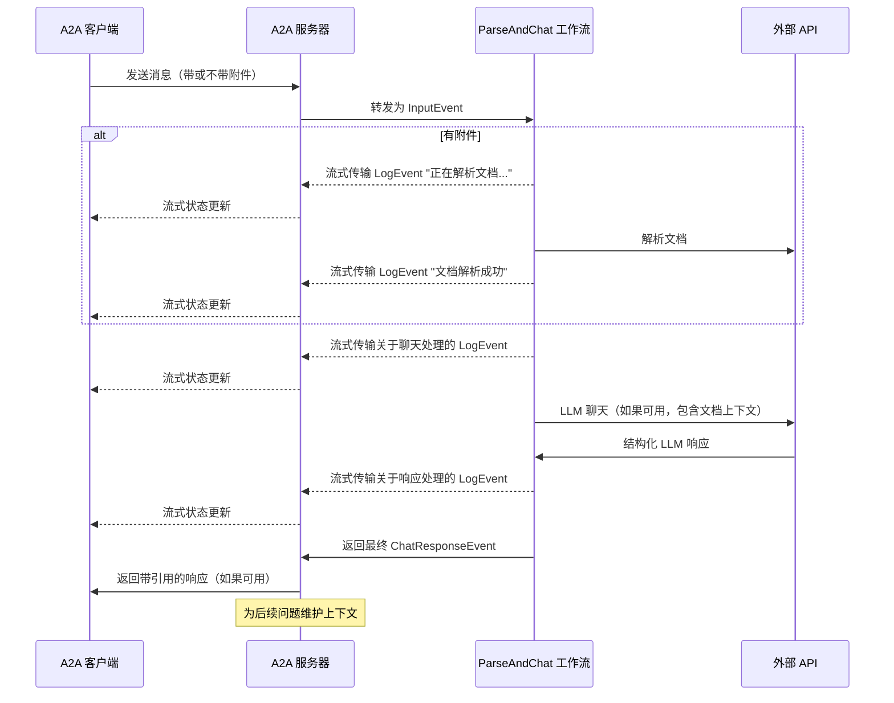

# 

本示例展示了一个使用 [LlamaIndex Workflows](https://docs.llamaindex.ai/en/stable/understanding/workflows/) 构建并通过 A2A 协议公开的对话代理。它展示了文件上传和解析、支持多轮对话的对话交互、流式响应/更新以及内联引用。

## 源代码
[a2a llama index file chat with openrouter](https://github.com/sing1ee/a2a_llama_index_file_chat)

## 工作原理

该代理使用 LlamaIndex Workflows 与 OpenRouter 提供一个对话代理，可以上传文件、解析文件并回答有关内容的问题。A2A 协议实现了与代理的标准化交互，允许客户端发送请求并接收实时更新。



## 主要功能

- **文件上传**：客户端可以上传文件并解析它们以为聊天提供上下文
- **多轮对话**：代理可以在需要时请求额外信息
- **实时流式传输**：在处理过程中提供状态更新
- **推送通知**：支持基于 webhook 的通知
- **对话记忆**：在同一会话中跨交互维护上下文
- **LlamaParse 集成**：使用 LlamaParse 准确解析文件

**注意：** 此示例代理接受多模态输入，但在撰写本文时，示例 UI 仅支持文本输入。UI 将来会变为多模态以处理此用例和其他用例。

## 先决条件

- Python 3.12 或更高版本
- [UV](https://docs.astral.sh/uv/)
- 访问 LLM 和 API 密钥（当前代码假设使用 OpenRouter API）
- LlamaParse API 密钥（[免费获取](https://cloud.llamaindex.ai)）

## 设置和运行

1. 克隆并导航到项目目录：

   ```bash
   git clone <repository-url>
   cd a2a_llama_index_file_chat
   ```

2. 创建虚拟环境并安装依赖项：

   ```bash
   uv venv
   uv sync
   ```

3. 使用您的 API 密钥创建环境文件：

   ```bash
   echo "OPENROUTER_API_KEY=your_api_key_here" >> .env
   echo "LLAMA_CLOUD_API_KEY=your_api_key_here" >> .env
   ```

   **获取 API 密钥：**
   - **OpenRouter API 密钥**：在 [https://openrouter.ai](https://openrouter.ai) 注册以获取免费 API 密钥
   - **LlamaCloud API 密钥**：在 [https://cloud.llamaindex.ai](https://cloud.llamaindex.ai) 免费获取

4. 运行代理：

   ```bash
   # 使用 uv
   uv run a2a-file-chat

   # 或激活虚拟环境并直接运行
   source .venv/bin/activate  # Windows 上：.venv\Scripts\activate
   python -m a2a_file_chat

   # 使用自定义主机/端口
   uv run a2a-file-chat --host 0.0.0.0 --port 8080
   ```

4. 在单独的终端中，运行 A2A 客户端 CLI：

  下载要解析的文件，或链接到您自己的文件。例如：

   ```bash
   curl -L https://arxiv.org/pdf/1706.03762 -o attention.pdf
   ```

   ```bash
   git clone https://github.com/google-a2a/a2a-samples.git
   cd a2a-samples/samples/python/hosts/cli
   uv run . --agent http://localhost:10010
   ```

   然后输入类似以下内容：

   ```bash
   ======= Agent Card ========
   {"name":"Parse and Chat","description":"Parses a file and then chats with a user using the parsed content as context.","url":"http://localhost:10010/","version":"1.0.0","capabilities":{"streaming":true,"pushNotifications":true,"stateTransitionHistory":false},"defaultInputModes":["text","text/plain"],"defaultOutputModes":["text","text/plain"],"skills":[{"id":"parse_and_chat","name":"Parse and Chat","description":"Parses a file and then chats with a user using the parsed content as context.","tags":["parse","chat","file","llama_parse"],"examples":["What does this file talk about?"]}]}
   =========  starting a new task ======== 

   What do you want to send to the agent? (:q or quit to exit): 这个文件讲的是什么？
   Select a file path to attach? (press enter to skip): ./attention.pdf
   ```

## 技术实现

- **LlamaIndex Workflows**：使用自定义工作流来解析文件然后与用户聊天
- **流式支持**：在处理过程中提供增量更新
- **可序列化上下文**：在轮次之间维护对话状态，可选择性地持久化到 redis、mongodb、磁盘等
- **推送通知系统**：基于 webhook 的更新，带有 JWK 身份验证
- **A2A 协议集成**：完全符合 A2A 规范

## 限制

- 仅支持基于文本的输出
- LlamaParse 前 10K 积分免费（基本设置约 3333 页）
- 内存基于会话且在内存中，因此不会在服务器重启之间持久化
- 将整个文档插入上下文窗口对于较大文件不可扩展。您可能希望部署向量数据库或使用云数据库对一个或多个文件运行检索以实现有效的 RAG。LlamaIndex 与[大量向量数据库和云数据库](https://docs.llamaindex.ai/en/stable/examples/#vector-stores)集成。

## 示例

**同步请求**

请求：

```
POST http://localhost:10010
Content-Type: application/json

{
  "jsonrpc": "2.0",
  "id": 11,
  "method": "tasks/send",
  "params": {
    "id": "129",
    "sessionId": "8f01f3d172cd4396a0e535ae8aec6687",
    "acceptedOutputModes": [
      "text"
    ],
    "message": {
      "role": "user",
      "parts": [
        {
          "type": "text",
          "text": "这个文件讲的是什么？"
        },
        {
            "type": "file",
            "file": {
                "bytes": "...",
                "name": "attention.pdf"
            }
        }
      ]
    }
  }
}
```

响应：

```
{
  "jsonrpc": "2.0",
  "id": 11,
  "result": {
    "id": "129",
    "status": {
      "state": "completed",
      "timestamp": "2025-04-02T16:53:29.301828"
    },
    "artifacts": [
      {
        "parts": [
          {
            "type": "text",
            "text": "这个文件讲的是 XYZ... [1]"
          }
        ],
        "metadata": {
            "1": ["引用 1 的文本"]
        }
        "index": 0,
      }
    ],
  }
}
```

**多轮示例**

请求 - 序列 1：

```
POST http://localhost:10010
Content-Type: application/json

{
  "jsonrpc": "2.0",
  "id": 11,
  "method": "tasks/send",
  "params": {
    "id": "129",
    "sessionId": "8f01f3d172cd4396a0e535ae8aec6687",
    "acceptedOutputModes": [
      "text"
    ],
    "message": {
      "role": "user",
      "parts": [
        {
          "type": "text",
          "text": "这个文件讲的是什么？"
        },
        {
            "type": "file",
            "file": {
                "bytes": "...",
                "name": "attention.pdf"
            }
        }
      ]
    }
  }
}
```

响应 - 序列 2：

```
{
  "jsonrpc": "2.0",
  "id": 11,
  "result": {
    "id": "129",
    "status": {
      "state": "completed",
      "timestamp": "2025-04-02T16:53:29.301828"
    },
    "artifacts": [
      {
        "parts": [
          {
            "type": "text",
            "text": "这个文件讲的是 XYZ... [1]"
          }
        ],
        "metadata": {
            "1": ["引用 1 的文本"]
        }
        "index": 0,
      }
    ],
  }
}
```

请求 - 序列 3：

```
POST http://localhost:10010
Content-Type: application/json

{
  "jsonrpc": "2.0",
  "id": 11,
  "method": "tasks/send",
  "params": {
    "id": "130",
    "sessionId": "8f01f3d172cd4396a0e535ae8aec6687",
    "acceptedOutputModes": [
      "text"
    ],
    "message": {
      "role": "user",
      "parts": [
        {
          "type": "text",
          "text": "那 X 事物呢？"
        }
      ]
    }
  }
}
```

响应 - 序列 4：

```
{
  "jsonrpc": "2.0",
  "id": 11,
  "result": {
    "id": "130",
    "status": {
      "state": "completed",
      "timestamp": "2025-04-02T16:53:29.301828"
    },
    "artifacts": [
      {
        "parts": [
          {
            "type": "text",
            "text": "X 事物是... [1]"
          }
        ],
        "metadata": {
            "1": ["引用 1 的文本"]
        }
        "index": 0,
      }
    ],
  }
}
```

**流式示例**

请求：

```
{
  "jsonrpc": "2.0",
  "id": 11,
  "method": "tasks/send",
  "params": {
    "id": "129",
    "sessionId": "8f01f3d172cd4396a0e535ae8aec6687",
    "acceptedOutputModes": [
      "text"
    ],
    "message": {
      "role": "user",
      "parts": [
        {
          "type": "text",
          "text": "这个文件讲的是什么？"
        },
        {
            "type": "file",
            "file": {
                "bytes": "...",
                "name": "attention.pdf"
            }
        }
      ]
    }
  }
}
```

响应：

```
stream event => {"jsonrpc":"2.0","id":"367d0ba9af97457890261ac29a0f6f5b","result":{"id":"373b26d64c5a4f0099fa906c6b7342d9","status":{"state":"working","message":{"role":"agent","parts":[{"type":"text","text":"正在解析文档..."}]},"timestamp":"2025-04-15T16:05:18.283682"},"final":false}}

stream event => {"jsonrpc":"2.0","id":"367d0ba9af97457890261ac29a0f6f5b","result":{"id":"373b26d64c5a4f0099fa906c6b7342d9","status":{"state":"working","message":{"role":"agent","parts":[{"type":"text","text":"文档解析成功。"}]},"timestamp":"2025-04-15T16:05:24.200133"},"final":false}}

stream event => {"jsonrpc":"2.0","id":"367d0ba9af97457890261ac29a0f6f5b","result":{"id":"373b26d64c5a4f0099fa906c6b7342d9","status":{"state":"working","message":{"role":"agent","parts":[{"type":"text","text":"正在与 1 条初始消息聊天。"}]},"timestamp":"2025-04-15T16:05:24.204757"},"final":false}}

stream event => {"jsonrpc":"2.0","id":"367d0ba9af97457890261ac29a0f6f5b","result":{"id":"373b26d64c5a4f0099fa906c6b7342d9","status":{"state":"working","message":{"role":"agent","parts":[{"type":"text","text":"正在插入系统提示..."}]},"timestamp":"2025-04-15T16:05:24.204810"},"final":false}}

stream event => {"jsonrpc":"2.0","id":"367d0ba9af97457890261ac29a0f6f5b","result":{"id":"373b26d64c5a4f0099fa906c6b7342d9","status":{"state":"working","message":{"role":"agent","parts":[{"type":"text","text":"已收到 LLM 响应，正在解析引用..."}]},"timestamp":"2025-04-15T16:05:26.084829"},"final":false}}

stream event => {"jsonrpc":"2.0","id":"367d0ba9af97457890261ac29a0f6f5b","result":{"id":"373b26d64c5a4f0099fa906c6b7342d9","artifact":{"parts":[{"type":"text","text":"这个文件讨论了 Transformer，一种完全基于注意力机制的新型神经网络架构，完全摒弃了循环和卷积 [1]。该文档将 Transformer 与循环和卷积层进行了比较 [2]，详细介绍了模型架构 [3]，并展示了机器翻译和英语成分解析任务的结果 [4]。"}],"metadata":{"1":["主流的序列转换模型基于复杂的循环或卷积神经网络，包括编码器和解码器。性能最佳的模型还通过注意力机制连接编码器和解码器。我们提出了一种新的简单网络架构 Transformer，完全基于注意力机制，完全摒弃了循环和卷积。在两个机器翻译任务上的实验表明，这些模型在质量上更优越，同时更易于并行化，训练时间显著减少。我们的模型在 WMT 2014 英德翻译任务上达到了 28.4 BLEU，比现有最佳结果（包括集成）提高了 2 BLEU 以上。在 WMT 2014 英法翻译任务上，我们的模型在 8 个 GPU 上训练 3.5 天后建立了新的单模型最先进 BLEU 分数 41.8，这只是文献中最佳模型训练成本的一小部分。我们通过将其成功应用于大型和有限训练数据的英语成分解析，表明 Transformer 能够很好地泛化到其他任务。"],"2":["在本节中，我们比较了自注意力层与通常用于将一个可变长度符号表示序列 (x1, ..., xn) 映射到另一个等长序列 (z1, ..., zn) 的循环和卷积层的各个方面，其中 xi, zi ∈ Rd，例如典型序列转换编码器或解码器中的隐藏层。为了激发我们对自注意力的使用，我们考虑三个要求。",""],"3":["# 3 模型架构"],"4":["# 6   结果"]},"index":0,"append":false}}}

stream event => {"jsonrpc":"2.0","id":"367d0ba9af97457890261ac29a0f6f5b","result":{"id":"373b26d64c5a4f0099fa906c6b7342d9","status":{"state":"completed","timestamp":"2025-04-15T16:05:26.111314"},"final":true}}
```

您可以看到工作流产生了一个带有内联引用的工件，这些引用的源文本包含在工件的元数据中。如果我们在同一会话中发送更多响应，代理将记住之前的消息并继续对话。

## 了解更多

- [A2A 协议文档](https://google.github.io/A2A/#/documentation)
- [LlamaIndex Workflow 文档](https://docs.llamaindex.ai/en/stable/understanding/workflows/)
- [LlamaIndex Workflow 示例](https://docs.llamaindex.ai/en/stable/examples/#agentic-workflows)
- [LlamaParse 文档](https://github.com/run-llama/llama_cloud_services/blob/main/parse.md)
- [OpenRouter API](https://openrouter.ai)